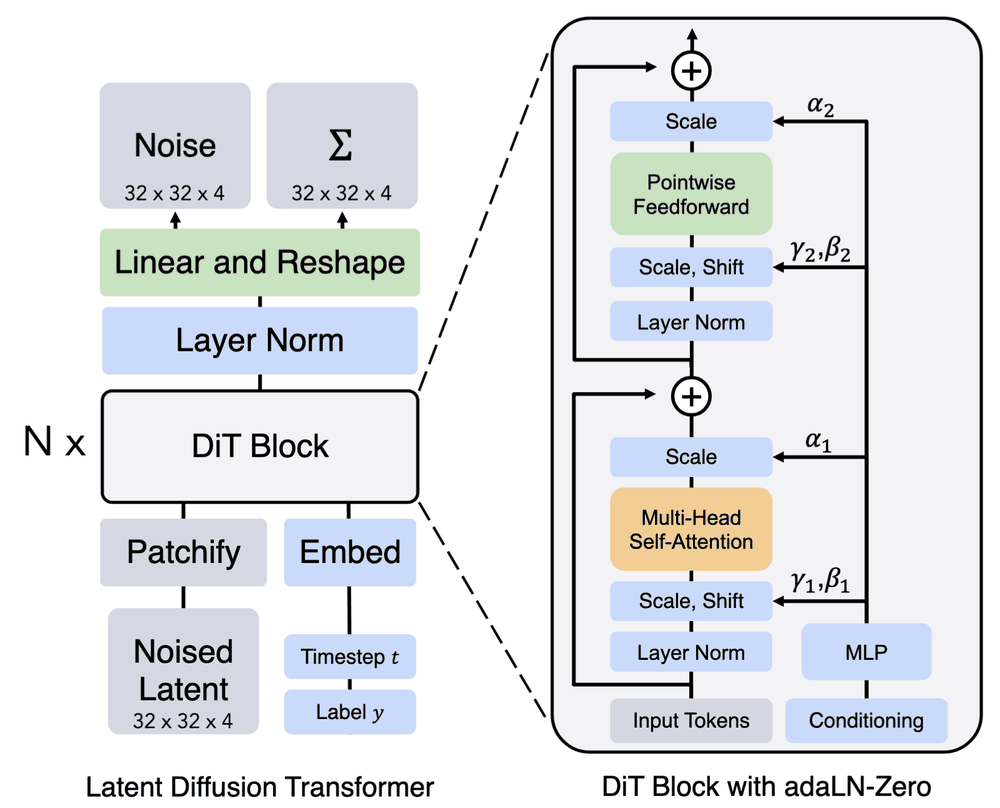

最近阅读 **视频生成** 相关的原始算法、算法变体、系统优化方法。

主要架构："U-Net 做 backbone" 与 "Transformer 做 backbone( DiT )".

DiT 是当前图像生成和视频生成的主流架构，DiT 本身衍生出非自回归生成（Bidirectional）和自回归生成（Autoregressive）两类架构。当前发布的视频生成模型，例如 Sora, Wan, Hunyuan 以及 Seedence 都是非自回归视频生成，未出现主流的自回归视频生成模型。但是非自回归范式下只能生成 $5\sim 10~\mathrm{s}$ 的短视频. 我感觉在后面在算力和优化足够成熟时仍然会转向自回归的生成范式。

DiT 原始论文：《Scalable Diffusion Models with Transformers》（ICCV 2023）. 

<figure markdown>
  { width="500" }
  <figcaption>DiT 架构：左侧是 Latent Diffusion Transformer 的整体流程，右侧是带 adaN-Zero 的 DiT Block 内部结构</figcaption>
</figure>

-----

当前论文里，面向非自回归视频生成的，主要关注稀疏注意力计算、减少去噪步数；面向自回归视频生成的，主要关注稀疏注意力计算、KV Cache 压缩。

| 论文名称 | 会议与年份 | 适配的生成架构 | 主要优化方向 | Observation | 优化思路 | 实际效果（部分） |
|:---:|:---:|:---:|:---:|:---:|:---:|:----:|
|《Timestep Embedding Tells: It’s Time to Cache for Video Diffusion Model》|CVPR 2025 | 非自回归视频生成 |  减少去噪步数  | DiT backbone 的 transformer layers 相邻去噪 steps 的输出高度相似 | transformer layers 相邻 steps 的输出结果可以加入 cache 做复用，直接跳过本轮 step. 计算若干步 steps 累计误差，超过阈值更新 cache. | OpenSora-Plan 模型生成 $65$ frame（$512~\mathrm{p}$）端到端 $6.83\times$ 加速|
|《Sparse VideoGen: Accelerating Video Diffusion Transformers with  Spatial-Temporal Sparsity》| ICML 2025 | 非自回归视频生成 | 稀疏注意力计算 | DiT 架构中 transformer layers 里面的不同 head 具有不同的 attention pattern. 部分 head 仅关注相邻若干帧（spacial），部分 head 仅关注全部帧的某些特定位置（temporal）| 对于某一 prompt 输入，通过采样少量 tokens 计算 full attention，根据 attention pattern 将不同的 head 分为 spacial 与 temporal 两类，各自重排 tokens 后做 sparse attention | Hunyuan Video 模型生成 128 frame（$720~\mathrm{p}$）端到端 $1.92\times$ 加速 |
| 《Fast Video Generation with SLIDING TILE ATTENTION》| ICML 2025 | 非自回归视频生成 | 稀疏注意力计算 | DiT 架构中，单个 token 对于其他 token 的注意力分布具有高度的局部性，集中在一个 3D 的 local window 中。但如果在 flash attention 分块计算时只计算 sliding window 内的注意力又会引入大量 mask 的计算开销，出现很多 mixed blocks | 将全部 frames 的 tokens 分为若干 3D 的 tile，摒弃原来以 token 为单位的 sliding window，改为以 tile 为单位的 sliding window. 完全消除 mixed blocks，flash attention 分块计算时无 mask 的计算开销 | Hunyuan Video 模型生成 5s（$720~\mathrm{p}$）端到端 $10.45\times$ 加速，baseline 是 flash attention 加速的 full attention |
| 《Efficient Autoregressive Video Diffusion with Dummy Head》| 暂无 | 自回归视频生成 | 稀疏注意力计算 + KV Cache 压缩 | DiT 架构下自回归视频生成模型中，不同注意力 head 的 attention pattern 可归为三类。**Sink 类**只关注最开头几个 frame 和当前 frame. **Neighbor 类**只关注最近的几个 frame 和当前 frame. **Dummy** 类只关注当前 frame. | 对于某一个 promp 输入，若干轮常规去噪 steps 做完后采样少量的 tokens 计算 full attention，根据 pattern 将不同的 head 通过动态规划分为三种 head 类。不同类的 head 可以根据各自的需求压缩 KV Cache（只保留部分有用的帧）| Self Forcing 模型生成 $5~\mathrm{s}$ 短视频端到端 $1.4\times$ 加速，KV Cache 显存占用降低到原来的 $27.8\%$.（实验里估计 Self Forcing baseline 本身也用了 local window）|
| 《FAST-AR: Fast Autoregressive Video Diffusion and World Models with  Temporal Cache Compression and Sparse Attention》 | ICML 2026 | 自回归视频生成 | 稀疏注意力计算 + KV Cache 压缩 | DiT 架构下自回归视频生成模型中，存在跨帧的语义高度相似的 tokens 构成的 cluster，单个 cluster 中存在 KV 冗余存储。注意力计算（self 与 cross）高度稀疏，可以通过 token 分组或者搜索来选择 TopK 重要的 token 计算 attention | 分组与搜索方法是 Locality-Sensitive Hashing 或者 Quantized Similarity Search. 其一，找到与当前 token 相似度最高的 cluster，若 $q^{T}k$ 超过阈值则用该 token 作为代表来更新该 cluster 的 kv，据此压缩 KV Cache. 其二，对于视频的 tokens，通过 LSH 或者 QSS 找到 $q^{T}k$ 值最高的若干个 token 来计算自注意力。其三，对于输入的文本 tokens，用相同的方式判断本轮 cross attention 中是否存在视频 token 使得 $q^{T}k$ 大于阈值，如果不会则直接 prune. | 相较于 baseline Rolling Forcing 模型，可以实现端到端 $10.8\times$ 加速比，KV Cache 可以压缩到原来的 $16.8\%$ 左右 |
|《PipeFusion: Patch-level Pipeline Parallelism for  Diffusion Transformers Inference》| NeurIPS 2025 | 图像生成 | Pipeline Parallelism + Patch Pipelining | 传统的 DiT 的 TP 方案或者 SP 方案均需要在每一个 transformer layer 中做两次集合通信。DiT 在去噪时，不同 steps 之间图像往往具有高度的相似性，step $T$ 的注意力计算也可以使用 step $T+1$ 的 KV Cache，因此图像的 patches 之间不需要完全同步，可以流水化 | 在 transformer layers 的维度做流水化，将连续若干个 layer （一个 stage）分配给一个 GPU，只需要在 stage 边界处做一次集合通信。在图像的 patch 维度做流水化，某一时刻不同的 GPU 上做不同的 patch 的不同 layers 的计算，当前一步的注意力计算使用前一步的 KV Cache，消除 patch 之间的同步 | SD3-medium 模型上相较于 baseline（$1$ GPU）实现 $4.9\times$ 加速 |

------

在 Hunyuan Video1.5 的技术报告里面，在 Sparse Attention 的计算问题上，其采用的也是 《Fast Video Generation with SLIDING TILE ATTENTION》里面的方法："sliding window + tile 化“。但是其 sparse 的程度更高，在 3D sliding window 里面接着只选择 TopK 相关的 block 做注意力近似计算。不过，Hunyuan 的报告里面没有提过减少去噪步数或者 KV Cache 压缩相关的优化手段。

