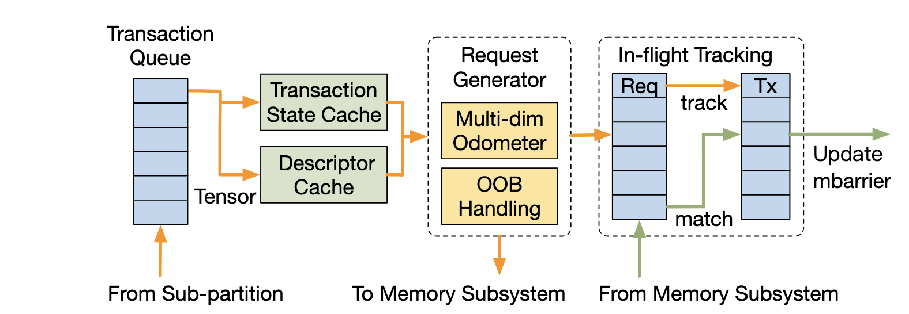
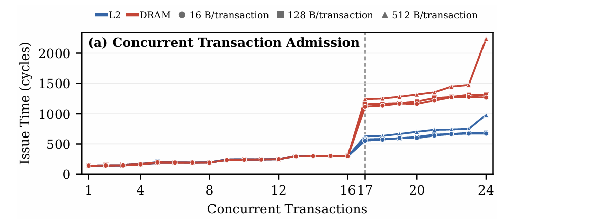
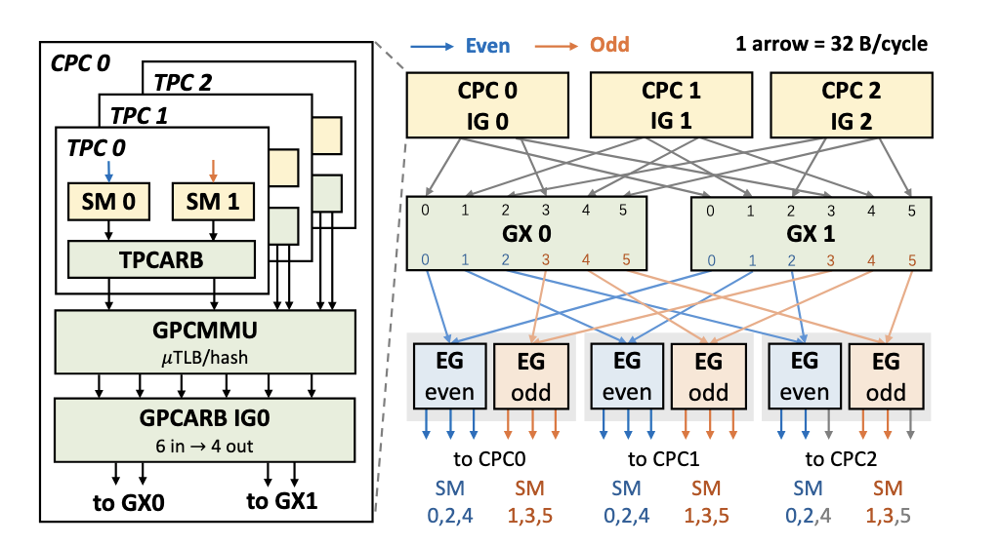

# FlashGPU-sim: Enabling GPU Modeling for  Modern Architectures and AI Workloads

论文链接：[《FlashGPU-sim: Enabling GPU Modeling for  Modern Architectures and AI Workloads》](https://arxiv.org/pdf/2609.15311)

仓库链接：[FlashGPU-Sim](https://github.com/FlashGPU-Sim/FlashGPU-Sim)

**BackGround**: 当前 NVIDIA 厂家在内的 GPU 底层硬件架构处于黑盒状态，无论是做软件 kernel 的性能调优还是硬件层面的优化，均需要一个良好（high fidelity）的模拟器来定量测试。目前已知的 GPU 模拟器（包括 GPGPU 等）均是面向 Amphere 及其之前的 GPU 架构设计的，对于 Hopper 与 Blackwell 架构中新添加的许多重要的硬件 mechanism 不予支持，需要新的模拟器来补齐这一差距。

 

主要补充的 mechanism 包括：

1. TMA( Tensor Memory Accelerator ) 异步数据搬运；
2. Asynchronous Memory Barrier（用于 Data Movement 同步）；
3. DSMEM( Distributed Shared Memory ) 分布式共享内存；
4. 在 SM 上方增加 GPC 这一组织层级（夹着 TPC 与 CPC 两个 layers）；
5. Tensor Core 演进，从 `mma` 到 Hopper 架构 `wgmma` 到 Blackwell 架构 `tcgen05`.

  

## 1.1 对 TMA 的建模

<figure markdown>
  { width="500" }
  <figcaption>对 TMA pipeline 的建模</figcaption>
</figure>

TMA 是单个 SM 独有，四个 sub-partion 共享。单个 `cp.async.bulk` 指令作为一个 TMA Transaction，传输的数据量是变长的，需要拆分为若干个等长的 request 一个一个 issue. 这里 descriptor cache 就是从 global memory 加载到 shared memory 的 cuTensorMap，提高重复访问的效率。注意，普通的 `cp.async.bulk` 不需要 cuTensorMap，只有 `cp.async.bulk.tensor` 才需要。

在做 benchmark 的时候可以学习一下：

- independent operation chain 可以测量单个 operation 的 issue gap;
- dependent operation chain 可以测量单个 operation 的 latency.
- 如果有 transaction cache 或者 issue slot 这样的有限结构，可以由单个 warp 连续 issue 或者多个 warp 同时 issue，测量 cache 或者 slot 的容量（最好要使单个 operation 时间稍微长一点，始终处于 in-flight 的状态）。

比如，对于 transaction cache 容量，benchmark 测试结果为：

<figure markdown>
  { width="500" }
  <figcaption>Transaction Cache 容量测试曲线</figcaption>
</figure>

除了 transaction cache 容量，还测试：

- TMA pipeline throughput，平均每周期 issue 的 request 对应的字节数；
- 根据 in-flight requests 数量以及单个 request 延迟推断 In-flight Tracking 所能记录的 request 最大数量；
- 处理越界数据的方法：for write，不会产生 request；for read，request 最多到达 L2 Cache，不会到 DRAM.

文章中提到 Little's Law（利特尔法则）基本原理，一个稳定系统中：
\[
L=\lambda W
\]
其中：
- \(L\)：系统中平均同时存在的任务数量；
- \(\lambda\)：平均到达或完成速率；
- \(W\)：每个任务在系统中停留的平均时间。

即：

> 并发数量 = 每周期处理多少请求 × 每个请求要停留多少周期。

------

  

## 1.2 Asynchronous Memory Barrier

主要测量 mbarrier 轮询的周期数，轮询主要包含两类 `test_wait` 与 `try_wait`:

| Wait Form | SASS Pattern | Latency( cycles ) |
|:----------|:-------------|--------:|
| test wait | PHASECHK | 42 |
| try wait + nohint  | PHASECHK.TRYWAIT | 42 |
| try wait + hint, complete | TRYWAIT + SLEEP + PHASECHK | 150 |
| try wait + hint, uncomplete | TRYWAIT + SLEEP + PHASECHK | hint dependent |

------

  

## 1.3 Evolving Tensor Core

从先前架构的 `mma` 到 Hopper 架构的 `wgmma` 到 Blackwell 架构的 `tagen05`，tensor core 的计算组织在不断变化，文章里提到如何从某一个架构的 SPEC 手册里面提取 tensor core 的理论算力信息。 

Let $T_{\mathrm{chip}}$ denote the peak dense tensor throughput in $\mathrm{TOPS}$ and $S$ the number of SMs. An mma.sync of shape $M \times N \times K$ performs $2M N K$ operations, giving the theoretical per-SM issue gap: 

$$
\mathrm{Gap}^{\mathrm{theo}}_{\mathrm{SM}} = \frac{2M N K \cdot S \cdot f }{T_{\mathrm{chip}} \times 10^{3}}~(\mathrm{cycles})
$$  

where $f$ is the SM clock frequency in $\mathrm{GHz}$. Since each SM contains $P=4$ tensor-core sub-partitions, the corresponding single-warp theoretical gap is $\mathrm{Gap}^{\mathrm{theo}}_{\mathrm{warp}} = P \times \mathrm{Gap}^{\mathrm{theo}}_{\mathrm{SM}}$. 

实际的 Gap 和 Latency 通过 benchmark 测量。`wgmma` 和 `tcgen05` 有一个共同的 tensor core 算力模型，文章提到【For each operation, its workload of $2M N K$ $\mathrm{FLOPs}$ is converted into a compute service time using a data-type-specific per-SM service rate. Based on our measurements, the FP16 service rate is set to $4096~\mathrm{FLOP/SM/cycle}$ on H100 and $8192~\mathrm{FLOP/SM/cycle}$ on B200. All concurrent tensor operations on the same SM share this service capacity, bounding their aggregate compute throughput by the configured rate.】也就是单个 SM 的算力是各个 warp 共享的，尽管实际各个 warp 的 `wgmma` 或者 `tcgen05` 是并发的还是并行的未可知，但是基于该 capacity 的建模是较为准确的。

------

  

## 1.4 分布式共享内存

根据 NVIDIA DSMEM patent 构建的模型如图：

<figure markdown>
  { width="500" }
  <figcaption>Distributed Shared Memory 建模</figcaption>
</figure>

SM 的组织层次也比较清楚了，两个 SM 组成一个 TPC( Texture Processing Unit )，三个 TPC 组成一个 CPC( Compute Processing Unit )，三个 CPC 组成一个 GPC( Graphic Processing Unit ). 所以一个满配的 GPC 包含 $18$ 个 SM.

DSM 性能不仅取决于链路带宽，还强烈取决于流量方向、发送源是否相同，以及反向回复流量的大小。可观测规律包含：

- 远端访问有明显固定开销：SM-to-SM 单向约 $78~\mathrm{cycles}$，依赖型 remote load 往返约 $220~\mathrm{cycles}$，remote store 可见约 $625~\mathrm{cycles}$;
- 每个 SM 有独立的发送上限，约 $21~\mathrm{B/cycle}$，不能借用空闲邻居 SM 的带宽;
- 同一 SM 发出的同方向流量共享 send budget，总吞吐基本不会超过约 $21~\mathrm{B/cycle}$;
- 相反方向的流量由不同 SM 分别发送，可以利用两个 send budget，因此吞吐更高;
- Remote load 包含读请求和较大的反向数据回复，SM1 与 SM2 双向访问时 request/reply 竞争严重，每方向吞吐下降约 $23\%$;
- Store 和 TMA put 的反向流量主要是可合并 ACK，因此 SM1 与 SM2 互相访问时双向竞争较轻，每方向仅下降约 $4\% \sim 5\%$;

注意：上述依赖型 remote load 或者 remote store 的计算逻辑是 $T_{\mathrm{remote}} = T_{\mathrm{local}}+T_{\mathrm{remote}}^{\mathrm{request}}+T_{\mathrm{remote}}^{\mathrm{reply}}$，其中 $T_{\mathrm{local}}$ 是 SM 读写本地 shared memory 的固有开销，剩下两段 request 和 reply 是 remote 额外的 overhead. 而单个 $T_{\mathrm{remote}}^{\mathrm{request}}$ 与 $T_{\mathrm{remote}}^{\mathrm{reply}}$ 就是 SM-to-SM 的单向约 $78~\mathrm{cycles}$ 的开销。 

FlashGPU-Sim 因而采用“每个 SM 一个发送预算，request queue 和 reply queue 共同竞争”的模型，可以较好地模拟上述约束。

-------

  

此外，FlashGPU-Sim 本身是 execution-driven, cycle-accurate 的模拟器。

当前主流的 GPU 模拟器分为 execution-driven 与 trace-driven:

- Execution-driven 在模拟过程中执行程序并动态产生指令流；
- Trace-driven 预先记录真实硬件的动态指令流，模拟时只重放。

比如执行一段 `while( cond ){ }` 循环，对于 execution-driven 的模拟器，其会按照编译好的 PTX 汇编指令逐条执行分支指令，实时判断是否应该跳转；对于 trace-driven 的模拟器，其会首先在一块 GPU 卡上运行一遍 kernel，记录好每一个 warp 执行的 SASS 指令流，然后再在模拟器里面按顺序重放。

Trace-driven 模拟器有两个缺陷。其一，如果指令流中出现异步指令，比如 mbarrier 的结束是隐式的，无法追踪到。其二，如果要做硬件参数的调整或者硬件部件的增减，已有的 GPU 计算卡做不了自然也就得不到 SASS 指令流，trace-driven 的模拟器也就无法重放，还是上面的例子，如果因为硬件参数的变化使得 `while( )` 循环结束的时间改变，trace-driven 的模拟器感知不到。

当开启 GPC cluster 这一层级时，CPU 上绑核的单 thread 模拟一个 GPC 内的逻辑；未开启 GPC cluster 这一级时，CPU 上绑核的单 thread 模拟一个 SM 内的逻辑。对于 FlashGPU-Sim 的另一个特性：cycle-accurate. 处理的方式如下：

- 在 Simulated Cycle $t$ 中
    - 并行计算阶段
        - $\mathrm{SM}_0/\mathrm{GPC}_0$ 推进计算，产生通信/访存请求；
        - $\mathrm{SM}_1/\mathrm{GPC}_1$ 推进计算，产生通信/访存请求；
        - $\mathrm{SM}_2/\mathrm{GPC}_2$ 推进计算，产生通信/访存请求；
        - $\cdots$
    - 同步点
    - 确定性共享资源阶段
        - DSM fabric 每个 GPC 推进一个 cycle;
        - Crossbar Arbitration 推进一个 cycle;
        - Interconnect 推进一个 cycle;
        - L2 Cache 推进一个 cycle;
        - DRAM 推进一个 cycle.
- 进入 Simulated Cycle $t+1$ 中
    - $\cdots$

这样做将计算的 operations 与访存/通信的 operations 解耦，保证有序性。

当前 FlashGPU 主要是 GPU 单卡的模拟，下一步应该继续探索多卡通信的建模。